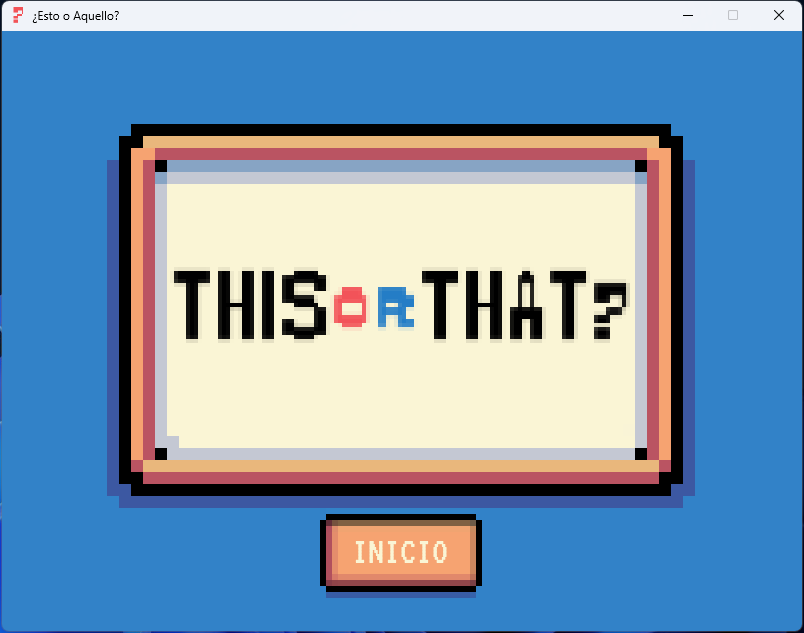
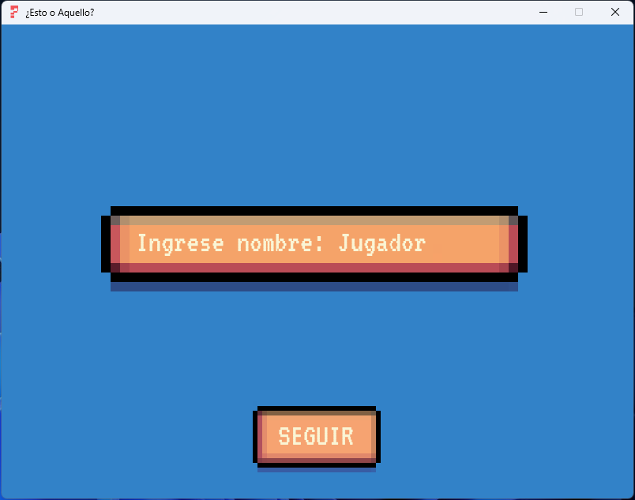
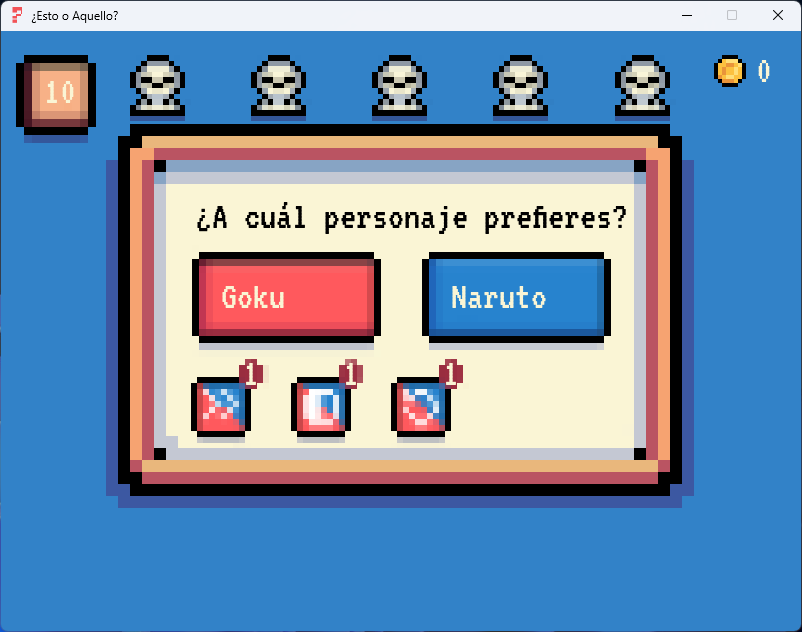
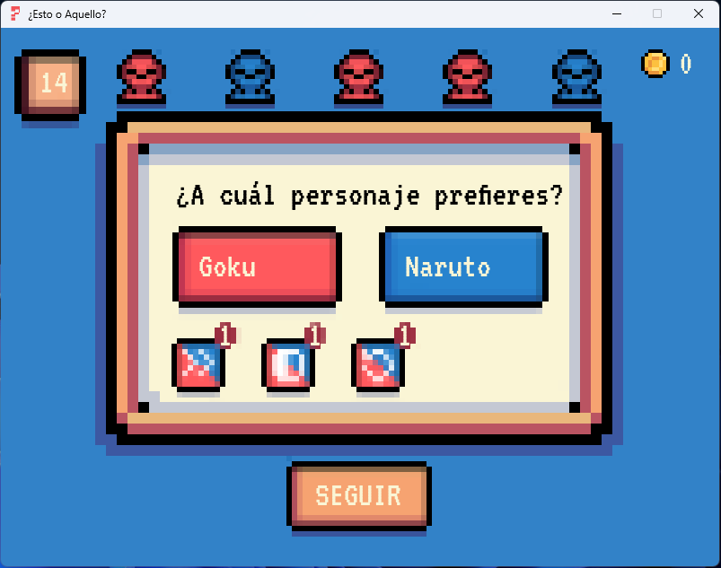
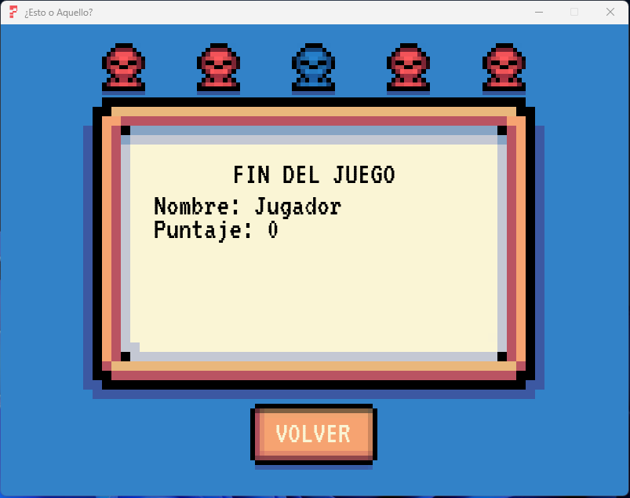

<h1 align="center">Esto_o_Aquello</h1>

# Descripción del Juego
¿Esto o Aquello? es un juego de preguntas y respuestas donde los jugadores deben elegir entre dos opciones. El objetivo es responder correctamente la mayor cantidad de preguntas posibles antes de que se acabe el tiempo.

## Estructura de Archivos:
~~~ CSS
Esto_o_Aquello/
├── assets/
│   ├── fonts/
│   │   └── VT323.ttf
│   ├── images/
│   │   ├── barra.png
│   │   ├── boton_azul.png
│   │   ├── boton_rojo.png
│   │   ├── boton.png
│   │   ├── cuadro.png
│   │   ├── final.png
│   │   ├── half.png
│   │   ├── inicio.png
│   │   ├── logo.png
│   │   ├── mini_boton.png
│   │   ├── moneda.png
│   │   ├── next.png
│   │   ├── nombre.png
│   │   ├── preguntas.png
│   │   ├── reload.png
│   │   ├── resultados.png
│   │   ├── titulo.png
│   │   ├── voto_azul.png
│   │   ├── voto_neutro.png
│   │   └── voto_rojo.png
│   ├── sounds/
│   │   ├── Game_Over.wav
│   │   ├── Menu_Select.wav
│   │   ├── Pickup_Coin.wav
│   │   └── Soundtrack.mp3
├── data/
│   ├── preguntas.json
│   └── puntajes.csv
├── modules/
│   ├── juego.py
│   ├── utilidades.py
│   └── visuales.py
└── main.py
~~~

# Instrucciones del Juego
1. Pantalla de Inicio:
   - Al iniciar el juego, se muestra la pantalla de inicio. Haz clic en el botón "INICIO" para comenzar.
     

2. Ingresar Nombre:
   - Ingresa tu nombre utilizando el teclado y presiona "SEGUIR" para continuar.
     

3. Pantalla de Preguntas:
   - Se te presentará una pregunta con dos opciones. Haz clic en la opción que creas correcta.
   - Puedes usar comodines "Next", "Half" y "Reload" para ayudarte a responder.
     

4. Pantalla de Resultado:
   - Después de responder una pregunta, verás si tu respuesta fue correcta o no. Haz clic en "SEGUIR" para la próxima pregunta.
     

5. Pantalla de Fin del Juego:
   - Cuando el juego termine, verás tu puntaje final y los votos. Puedes volver a la pantalla de inicio haciendo clic en "VOLVER".
     

# Gameplay:
- [Video](https://drive.google.com/file/d/1mrWutDFRWOYNK48XMKaAAuDFva95momC/view?usp=sharing)